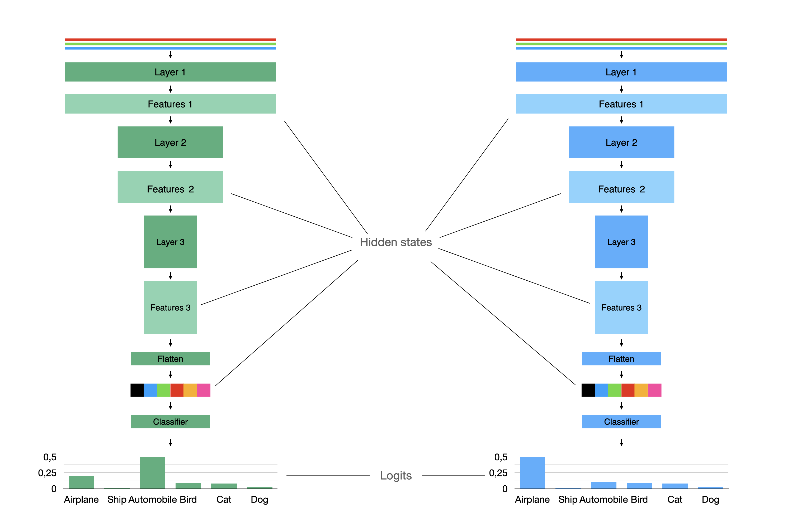
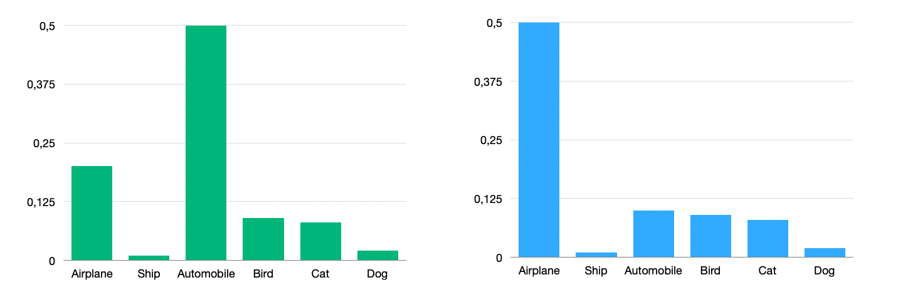
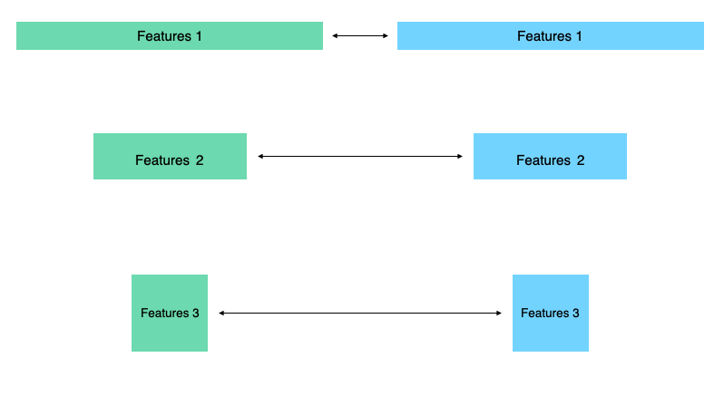

Distillation
============

Philosophy and main idea
------------------------
Method proposed in `Distilling the Knowledge in a Neural Network <https://arxiv.org/abs/1503.02531>`_
paper. We can train one teacher model for a task and then transfer knoweledge to the other student network.
In classical approach teacher is a big and slow network and student is a smaller model and we need student to perform
as better as a teacher.

Let's take a look on the simple image classification example:

The most simple way is to look on the probability distribution of the teacher model and the student model and force student
to produce same distribution as a teacher.

The most common way to measure difference between distribution called KL-divergence.

.. math::
    KL = \sum_x p_1(x) \log\left(\frac{p_1(x)}{p_2(x)}\right)

You can use ``KLDivLoss`` for applying this loss. It tooks student's and teacher's logits.

.. autoclass:: compressors.distillation.losses._kl_loss.KLDivLoss

Or just add ``KLDivCallback`` to ``DistilRunner`` if you are using Catalyst.

.. autoclass:: compressors.distillation.callbacks.KLDivCallback

We also can add difference between hidden states.

For example we can use :math:`L_2`-norm for this vectors with ``MSEHiddenStatesLoss``

.. autoclass:: compressors.distillation.losses.MSEHiddenStatesLoss

or callback

.. autoclass:: compressors.distillation.callbacks.MSEHiddenStatesCallback

But we can have not only vectors in hidden states. We can also have tensors like here with shapes :math:`(C\times H\times W)`.

You can also apply :math:`L_2`-norm here, but experiments shows that you can use something more complex like
`Attention Transfer <https://arxiv.org/abs/1612.03928>`_.

In compressors this method implemented in

.. autoclass:: compressors.distillation.losses.AttentionLoss

and

.. autoclass:: compressors.distillation.callbacks.AttentionHiddenStatesCallback

.. toctree::

   loss_functions
   callbacks
   runners
   data
