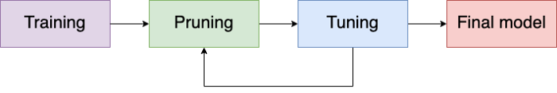
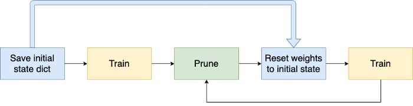
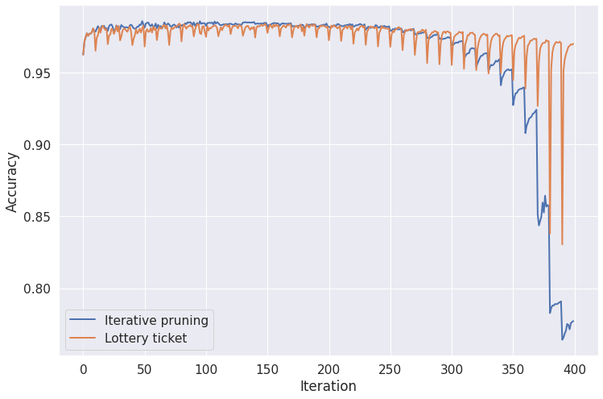
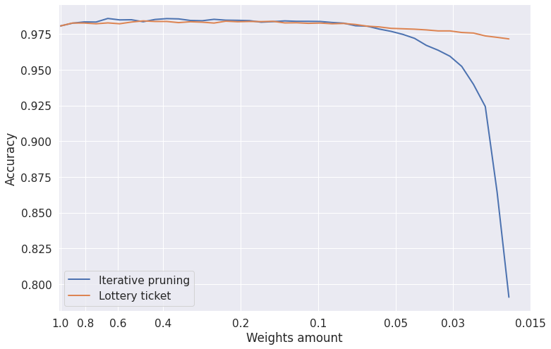
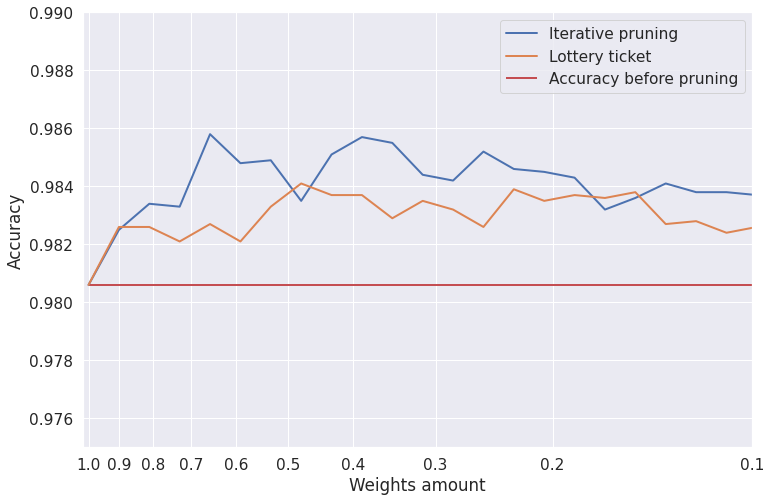

# Lottery Ticket

Small study about lottery ticket hypothesis.
Refactored experiments from my [blogpost](https://medium.com/pytorch/pruning-with-catalyst-50e98f2cef2d).

Before run experiments you should clone repo with:
```bash
git clone https://github.com/elephantmipt/compressors.git && cd compressors
```

To run iterative pruning you can use




```bash
python examples/lottery_ticket/prune.py
```

Same for the lottery ticket:



```bash
python examples/lottery_ticket/prune.py --lottery-ticket
```

## Results

After running scripts you should get something like this

Here is a plot for 40 pruning sessions:



Best accuracy over session:



Pruned network even outperforms original on the first sessions



## Further reading

[Paper about lottery ticket hypothesis.](https://arxiv.org/abs/1803.03635)

[Paper about iterative pruning.](https://arxiv.org/pdf/2001.05050.pdf)